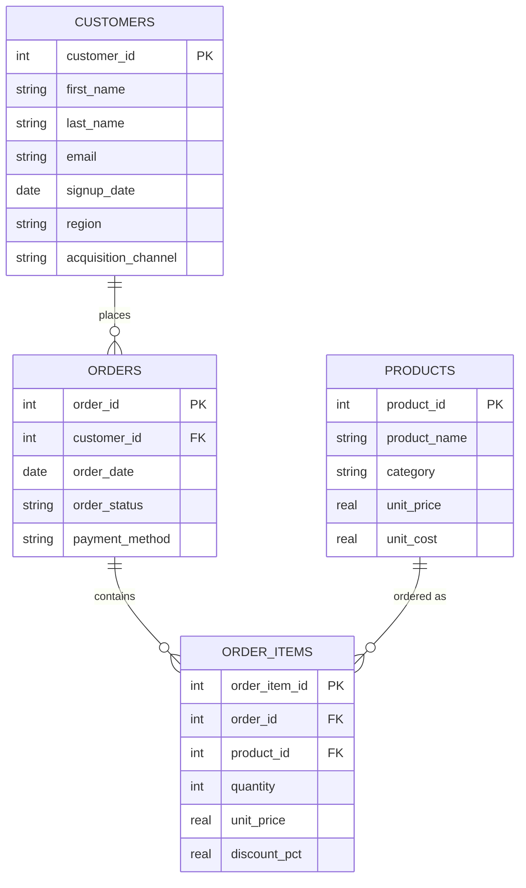
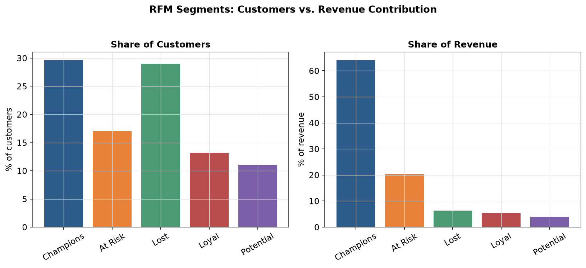
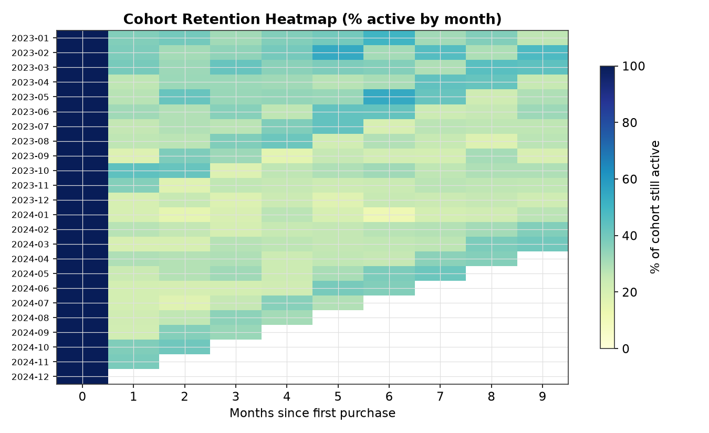
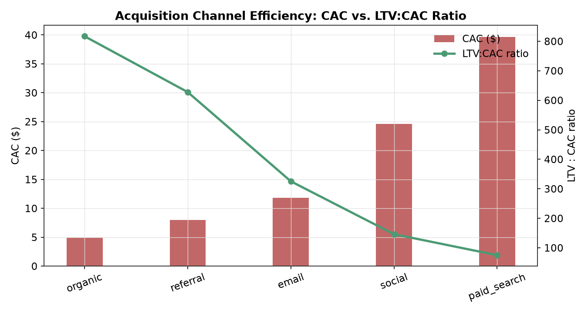
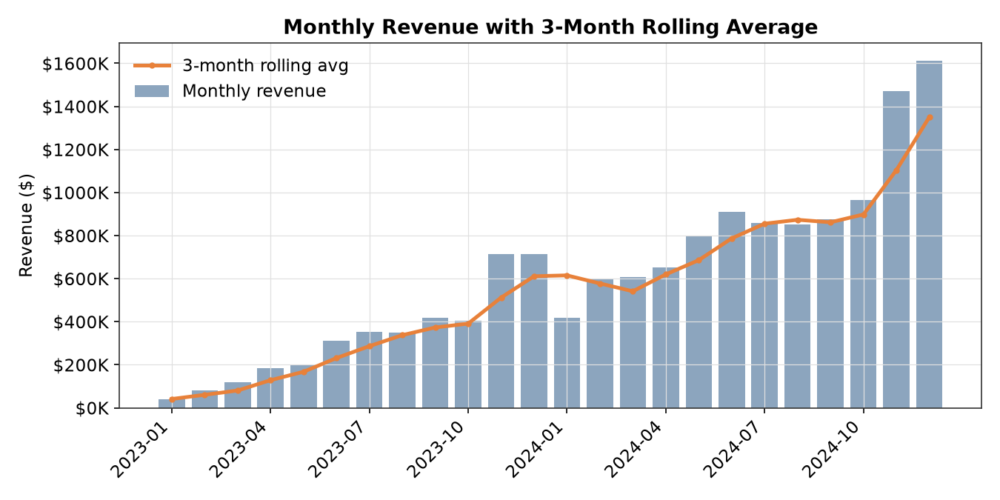

# RetailPulse — SQL-Driven Revenue & Retention Analytics

A self-contained SQL analytics project built on a synthetic e-commerce dataset
(5,000 customers, 150 products, ~24,700 orders across a 2-year window). It
answers five questions a retail analyst is regularly asked, using nothing but
SQL — window functions, CTEs, and index-aware query design — plus a thin
Python layer for data generation and charting.

## Schema



`marketing_spend(channel, month, spend_amount)` sits alongside this as a
fifth table, joined to `customers` by channel + signup month rather than a
formal FK — it's how the channel ROI analysis attributes spend to the
customers it acquired.

## Key findings

### 1. RFM segmentation surfaces a genuine Pareto split
Scoring every customer on Recency, Frequency, and Monetary value (via
`NTILE(4)` quartiles) and bucketing the result:

| Segment   | % of customers | % of revenue |
|-----------|----------------:|--------------:|
| **Champions** | **29.6%** | **64.0%** |
| At Risk   | 17.1% | 20.4% |
| Lost      | 29.0% | 6.3% |
| Loyal     | 13.2% | 5.4% |
| Potential | 11.1% | 4.0% |

Under a third of customers generate roughly two-thirds of revenue — the
kind of finding that directly informs where a retention budget should go.



### 2. Retention stabilizes around a ~30% loyal core
Cohort retention (customers grouped by signup month, tracked monthly
afterward) drops sharply after month 1, then holds roughly flat: **29.1%
average retention at month 3**, **31.1% at month 6**, across cohorts with
enough history to measure. The floor, not the initial drop, is the more
useful planning number — it's what a retention program is working to raise.



### 3. Acquisition channels are not equally efficient
Joining `marketing_spend` against realized customer LTV:

| Channel | CAC | Avg LTV | LTV:CAC |
|---|---:|---:|---:|
| organic | $4.91 | $4,012.35 | 816.9 |
| referral | $7.98 | $5,011.01 | 627.7 |
| email | $11.84 | $3,850.18 | 325.2 |
| social | $24.59 | $3,592.10 | 146.1 |
| paid_search | $39.68 | $2,975.95 | 75.0 |

Referral-acquired customers have the **highest average LTV** — but organic's
much lower acquisition cost gives it the better overall ratio. The
best-performing channel is **10.9x more capital-efficient** than the worst
(paid_search). Highest LTV and highest ROI aren't the same channel, which is
the more interesting takeaway than either number alone.



### 4. Revenue trend with seasonality
Monthly revenue with a 3-month rolling average, computed via `LAG()` and a
framed window (`ROWS BETWEEN 2 PRECEDING AND CURRENT ROW`). The Nov/Dec
holiday lift is visible every year in the underlying generator and shows up
cleanly in the trend.



### 5. Indexing a foreign key isn't optional at any real scale
The most common query against this schema — "pull one customer's order
history" — is exactly the kind of point lookup a support tool or account
page runs constantly. Benchmarked over 300 lookups on identical databases,
one without secondary indexes and one with them:

| | Before indexing | After indexing |
|---|---:|---:|
| Total time (300 lookups, 5 trials) | 1,861–2,173 ms | 8.4–10.0 ms |
| Time per lookup | ~6.2–7.2 ms | ~0.03 ms |

**~190–250x faster across repeated trials — consistently a 99.5%+ reduction
in latency** (wall-clock ratios are noisy at sub-millisecond scale, so this
was re-measured 5 times rather than quoted from a single run; the percentage
reduction is the stable number). The query plan shows why: without an index
on `orders.customer_id`, SQLite resolves the join by scanning the entire
`order_items` table for *every single lookup*. One `CREATE INDEX` removes
that scan entirely (`EXPLAIN QUERY PLAN` output for both cases is reproduced
in `sql/08_query_optimization.sql` and printed by the analysis script).

## Repo structure

```
retail-sql-analytics/
├── data/
│   └── generate_data.py       # synthetic data generator (fixed seed = reproducible)
│   └── raw/                   # generated CSVs (customers, products, orders, order_items, marketing_spend)
├── db/
│   └── retail.db              # SQLite database, indexed, ready to query
├── sql/
│   ├── 01_schema.sql
│   ├── 02_indexes.sql
│   ├── 03_revenue_growth.sql
│   ├── 04_cohort_retention.sql
│   ├── 05_rfm_segmentation.sql
│   ├── 06_channel_roi.sql
│   ├── 07_product_performance.sql
│   └── 08_query_optimization.sql
├── scripts/
│   ├── build_db.py            # CSVs -> schema -> db/retail.db
│   └── run_analysis.py        # runs every query, writes results/, renders visuals/
├── results/                   # query outputs as CSV
├── visuals/                   # chart PNGs referenced above
└── requirements.txt
```

## Running it yourself

```bash
git clone <your-repo-url>
cd retail-sql-analytics
pip install -r requirements.txt

python data/generate_data.py     # regenerate data/raw/*.csv (optional -- already included)
python scripts/build_db.py       # build db/retail.db from the CSVs
python scripts/run_analysis.py   # run all analyses, write results/ and visuals/
```

Every SQL file in `sql/` is also plain, standalone SQL — open any of them
directly in a SQLite browser (e.g. [DB Browser for SQLite](https://sqlitebrowser.org/))
against `db/retail.db` to explore interactively.

## Notes on the dataset

The data is synthetic, generated by `data/generate_data.py` with a fixed
random seed. It's built deliberately non-uniformly — customer value is
correlated with acquisition channel, purchase probability is seasonal, and
churn emerges naturally rather than being labeled — so that the analyses
above surface real patterns rather than being written to match a
predetermined answer. Total revenue grows sharply across the 2-year window
because the customer base itself is compounding over that period (this is a
generation artifact of a fixed-length demo, not a claimed real-world growth
rate), which is why the write-up above leans on ratios, segment splits, and
retention rates rather than a headline revenue-growth number.

## Possible extensions

- Swap SQLite for Postgres and add a `dbt` layer for the transformation logic
- Add a `sessions`/`events` table for funnel analysis (view → cart → purchase)
- Materialized views for the RFM and cohort queries, refreshed on a schedule
- A small Streamlit dashboard on top of `results/*.csv`

## License

MIT — see `LICENSE`.
